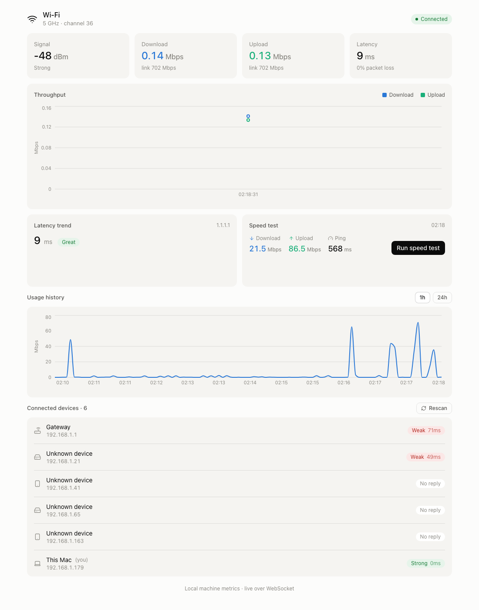

# WiFi Monitoring Dashboard

Real-time dashboard for local WiFi / network health on **macOS**: signal strength,
throughput, latency, LAN device discovery, and wireless security/diagnostics.
Node.js backend + React frontend, live updates over WebSocket.



_Light and dark themes (follows the OS, or force with a theme class on `<html>`;
OLED, cyberpunk, and emerald accent themes are also available in Settings)._

## Status

**Phase 1 (MVP) + Phase 2 + the full design-spec app, plus user stories US-01
through US-18 — complete and working.** Everything runs with **no sudo**. The UI
is a side-navigation app (flat borderless cards, two-weight type, light/dark) with
seven sections: **Overview · Devices · Floor Plan · History · Diagnostics · Alerts
· Settings** (plus a full-screen Kiosk mode launched from Overview).

| Feature | Source | Status |
|---|---|---|
| Signal (RSSI, SNR, channel, band, PHY, link rate, security) | `system_profiler SPAirPortDataType` | ✅ |
| Throughput (up/down rate) | `systeminformation.networkStats` | ✅ |
| Latency + packet loss | `ping` (configurable host) | ✅ |
| LAN devices (IP, MAC, vendor, hostname, LAN RTT quality) | `arp -a` + ping-sweep | ✅ |
| Speed test (download / upload / ping) | Cloudflare speed endpoints | ✅ |
| Historical charts (1h / 24h) + hourly rollups | MySQL, auto-fallback to embedded SQLite | ✅ |
| Device naming / tags / first-seen–last-seen + network topology map | localStorage (names/tags) + DB (sightings) | ✅ |
| Latency heatmap (day-of-week × hour) + CSV export | hourly rollups | ✅ |
| Channel congestion scan | `system_profiler` nearby-networks parse | ✅ |
| DNS-lookup vs raw-ping timing | `dns.Resolver` | ✅ |
| Traceroute on demand | `traceroute` (validated target) | ✅ |
| Alerts: disconnect / new-device / signal / latency / loss / roam / rogue AP / DFS hop + event log | poll-loop edge detection → DB | ✅ |
| Daily summary + downtime-today + Wi-Fi health score gauge | hourly rollups | ✅ |
| Settings: poll interval, ping host, retention, thresholds, theme, language, webhook | JSON settings file | ✅ |
| Slack/Discord push on critical events + public status endpoint | incoming webhook | ✅ |
| Email alerts on critical events (SMTP) | `nodemailer` | ✅ |
| Interactive floor-plan signal heatmap (upload image, drop pins) | localStorage | ✅ |
| Kiosk / wall-mount full-screen display mode | client-only overlay | ✅ |
| Picture-in-picture mini HUD widget | client-only overlay | ✅ |
| Time-travel history scrubbing slider | `/api/history` | ✅ |
| Drag-and-drop Overview card layout | localStorage | ✅ |
| Audio cues for events | Web Audio API | ✅ |
| Multi-language UI (en / es / de / fr) | `client/src/lib/i18n.js` | ✅ |
| Wi-Fi roaming / AP handover tracker | channel + BSSID change detection | ✅ |
| BSSID & beacon detail inspector | `system_profiler` parse | ✅ |
| Noise floor & SNR graph | RSSI − noise | ✅ |
| Wi-Fi 6 / 6E / 7 (802.11ax/be) PHY capability identifier | `system_profiler` PHY mode | ✅ |
| Rogue AP / Evil Twin detector | same-SSID / different-BSSID nearby-network match | ✅ |
| Distance estimator (path-loss algorithm) | RSSI + frequency | ✅ |
| DFS radar channel-hop detection log | DFS↔non-DFS channel transition | ✅ |
| Band steering efficiency analyzer | per-device band distribution | ✅ |
| Per-device router bandwidth | router admin | ⬜ future (stretch) |

See [docs/user-stories/README.md](./docs/user-stories/README.md) for the full
US-01–US-52 roadmap (US-01–18 shipped; US-19–52 are specced but not yet built).

## Run

Two processes. In separate terminals:

```bash
# 1. backend  (http://localhost:4000)
cd server && npm install && npm start

# 2. frontend (http://localhost:5173)
cd client && npm install && npm run dev
```

Then open **http://localhost:5173**. The Vite dev server proxies `/api` and `/ws`
to the backend, so you only need the one URL.

### Persistence (MySQL, auto-fallback to SQLite)

History, the event log, and device sightings are stored in a database. The backend
tries **MySQL** first; if it can't connect, it automatically falls back to an
embedded **SQLite** file at `server/data/wifi_dashboard.sqlite` — so persistence
works out-of-the-box with **zero setup**. To use MySQL instead:

```bash
# 1. create the database + a least-privilege app user (edit the password first)
mysql -u root -p < server/sql/init.sql

# 2. point the server at it
cp server/.env.example server/.env      # then set DB_PASSWORD (+ optional SMTP_PASS)

# 3. restart the backend — it creates its own tables on boot, in whichever engine connects
```

Connection is configured via `DB_HOST` / `DB_PORT` / `DB_NAME` / `DB_USER` /
`DB_PASSWORD` in `server/.env` (defaults: `127.0.0.1:3306`, db `wifi_dashboard`).

### Logging

The backend logs with **Winston** at four levels — `error`, `warn`, `info`,
`debug`. Console output is colorized + timestamped; everything is also written to
`server/logs/combined.log`, with `warn`+`error` mirrored to `server/logs/error.log`
(both rotate at 5 MB × 3 files). The default level is `info` (debug hidden); set
`LOG_LEVEL=debug` in `server/.env` to see per-tick detail. `server/logs/` is
gitignored.

### Email alerts (SMTP)

Enable **Email alerts** in Settings and fill in the SMTP host/port/from/to (the
same warning/danger events that drive the Slack/Discord webhook also send email).
The SMTP **password** is read only from `SMTP_PASS` in `server/.env`, never written
to `settings.json`. Use **Send test email** in Settings to verify it.

## macOS notes (important)

Recent macOS (this was built on **26.5.1 "Tahoe"**) changed WiFi access:

- The old `airport` CLI is **removed** and `networksetup -getairportnetwork` is
  broken. The reliable no-sudo source for RSSI / channel / rate is
  `system_profiler SPAirPortDataType` — slower (~1-2s), so the backend polls it
  every 5s while throughput/latency poll faster.
- **SSID is redacted** by macOS unless the process has Location Services
  permission (a plain Node process won't). RSSI, channel, PHY, link rate still
  come through. The UI shows "SSID hidden by macOS" in that case.
- **nmap is not required** — device discovery uses `arp -a` plus a lightweight
  `/24` ping-sweep to populate the ARP cache. Each device row shows its **MAC**
  and manufacturer (from the MAC's OUI). Randomized (locally-administered) MACs
  are tagged **"random MAC"** — modern phones/laptops randomize their MAC per
  network, so there's no real vendor to resolve for those.
- **Device manufacturers** resolve from a bundled OUI table (offline). Enable
  **Online device-vendor lookup** in Settings to resolve the rest via
  macvendors.com (only the 3-octet OUI is sent; results cached in
  `server/vendor-cache.json`). To name a device yourself, click its name to edit
  it (stored locally per-MAC).

## Architecture

```text
server/
  index.js              Express REST + ws WebSocket, poll loops, event detection
                         (roam / rogue-AP / DFS-hop detection lives here)
  collectors/
    wifiStats.js        system_profiler parser (RSSI, SNR, BSSID, PHY/Wi-Fi-6+7,
                         nearby networks) + networkStats throughput
    latency.js          ping with rolling packet-loss window (configurable host)
    lanDevices.js       arp parse + ping-sweep (per-host RTT) + reverse-DNS + vendor + sightings
    speedtest.js        Cloudflare-based download / upload / ping
    channels.js         nearby-network channel congestion (system_profiler)
    dns.js              DNS resolution timing (dns.Resolver)
    traceroute.js       on-demand traceroute, hop list (validated target)
  lib/
    env.js            loads server/.env (imported first)
    db.js             dual MySQL + embedded-SQLite driver, schema, graceful fallback
    ouiVendors.js     small local MAC-prefix → vendor table (no network calls)
    vendorLookup.js   macvendors.com lookup + cache (opt-in)
    security.js       rogue AP / Evil Twin detection (same SSID, different BSSID)
    history.js        snapshots + hourly rollups, heatmap, summary, CSV export
    events.js         event log (disconnect / new-device / roam / rogue-AP / threshold breaches)
    devices.js        per-MAC first-seen / last-seen / count
    settings.js       JSON-file settings (thresholds, cadences, toggles, webhook, email)
    email.js          SMTP alert emails (nodemailer); password from SMTP_PASS
    logger.js         Winston setup (see Logging below)
  sql/init.sql          one-time DB + app-user bootstrap

client/
  src/hooks/useLiveData.js   WebSocket + REST-on-load, rolling buffers, events, settings
  src/lib/signal.js          shared RSSI / RTT quality thresholds + estimateDistance() (path-loss)
  src/lib/deviceStore.js     localStorage MAC → { name, tag, trusted }
  src/lib/i18n.js            en/es/de/fr strings + getLanguage/setLanguage
  src/lib/audioNotifier.js   Web Audio event cues
  src/components/Sidebar.jsx  side navigation (collapses to icons < 768px)
  src/sections/               Overview, Devices, FloorPlan, History, Diagnostics,
                              Alerts, Settings, Kiosk (overlay launched from Overview)
  src/components/             Header, MetricCards, HealthGauge, NetworkTopology,
                              BssidInspector, SnrChart, BandSteeringAnalyzer, PipWidget,
                              charts, Heatmap, ChannelChart, Traceroute, EventLog,
                              RecentDevices (Tailwind v4, flat UI)
```

### WebSocket message schema

```json
{ "type": "wifi",       "data": { "...": "rssi/snr/bssid/phyMode/channel/...", "rogueAccessPoints": [] }, "timestamp": "..." }
{ "type": "throughput", "data": { ... }, "timestamp": "..." }
{ "type": "latency",    "data": { ... }, "timestamp": "..." }
{ "type": "devices",    "data": { ... }, "timestamp": "..." }
{ "type": "dns",        "data": { "avgMs": 0, "resolved": 3, "total": 3 } }
{ "type": "event",      "data": { "kind": "...", "severity": "info|warning|danger", "message": "..." } }
{ "type": "settings",   "data": { ... } }
{ "type": "speedtest",  "data": { "running": false, "download": 0, "upload": 0, "ping": 0 } }
```

### REST endpoints

Live metrics:

- `GET  /api/wifi` · `GET /api/throughput` · `GET /api/latency` · `GET /api/devices`
- `GET  /api/speedtest` — last result · `POST /api/speedtest/run` — run one now
- `POST /api/devices/scan` — trigger an immediate device rescan
- `GET  /api/health`

History (Overview + History sections):

- `GET  /api/history?range=1h|24h` — bucketed time-series for the usage chart
- `GET  /api/history/heatmap` — 7×24 day-of-week × hour latency grid
- `GET  /api/history/summary?range=24h|week` — recap (avg speed, worst spike, busiest hour)
- `GET  /api/history/export.csv?range=1h|24h` — CSV of raw snapshots

Diagnostics:

- `GET  /api/diagnostics/channels` — nearby-network count per channel
- `GET  /api/diagnostics/dns` — DNS resolution timing
- `POST /api/diagnostics/traceroute` `{ target }` — hop list with per-hop RTT

Alerts + Settings:

- `GET  /api/events?limit=` · `DELETE /api/events` — event log
- `GET  /api/downtime` — downtime-today counter
- `GET  /api/settings` · `PUT /api/settings` — thresholds, poll cadences, toggles, webhook, email
- `POST /api/email/test` — send a test email with the current SMTP settings
- `GET  /api/status/public` — read-only up/down summary (only when enabled in Settings)

## Design notes

- **Device quality pill** shows each device's **LAN round-trip time** bucketed to
  Strong/Fair/Weak. There's no per-device WiFi RSSI without router access, so LAN
  RTT is the honest, locally-measurable proxy (the distance estimator below is a
  separate, RSSI-based approximation for your own AP link only).
- **Speed test** uses Cloudflare's `speed.cloudflare.com` endpoints — no Ookla
  account or extra binary, and no flaky `speedtest-net` dependency.
- **Themes** follow the OS via `prefers-color-scheme` by default; force one (light,
  dark, OLED, cyberpunk, emerald) from Settings, which adds the matching class to
  `<html>`.
- **Distance estimate** (Devices/Overview) uses a standard log-distance path-loss
  formula on RSSI + frequency — a rough estimate, not a substitute for real
  triangulation.
- **Rogue AP / Evil Twin detection** flags nearby networks broadcasting your SSID
  from a different BSSID (optionally with a mismatched security standard); it's a
  heuristic over `system_profiler`'s nearby-network scan, not a full IDS.

## Next (stretch)

Specced but not yet implemented — see [docs/user-stories/README.md](./docs/user-stories/README.md)
for the full list (US-19 through US-52): port scanning, ARP-spoof/duplicate-IP
alerting, device OS fingerprinting, bandwidth-hog tracking, router security
scanning, ML-based anomaly detection, bufferbloat testing, Telegram/MQTT/Home
Assistant integrations, and a CLI companion, among others. Per-device bandwidth
via router admin API (OpenWrt / pfSense / documented local APIs only) is skipped
for stock ISP routers — fragile and low-value.
